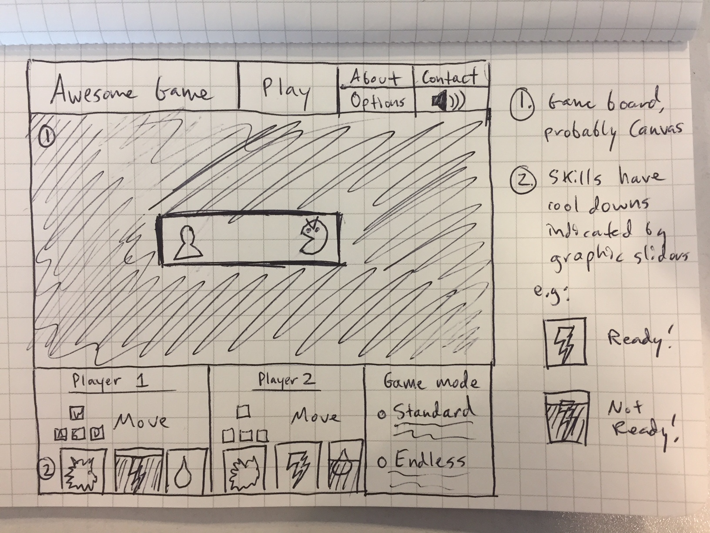
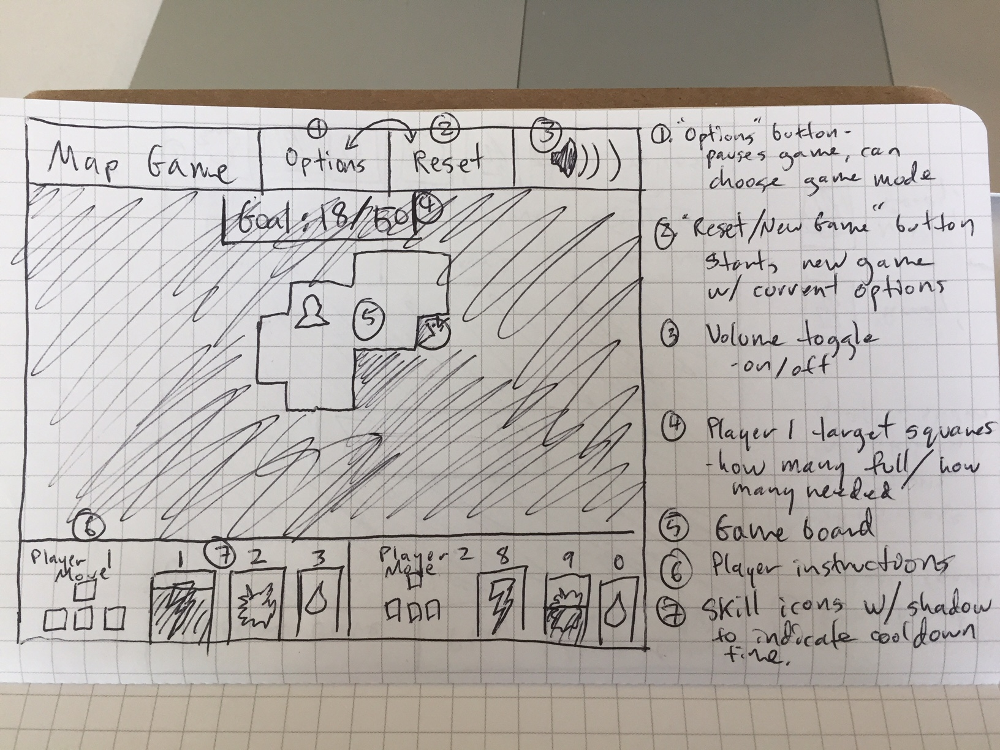
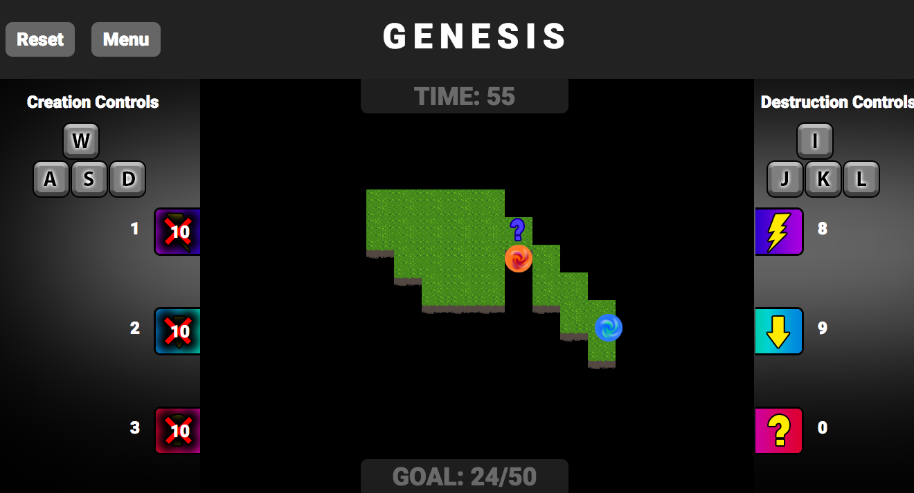

<h1>G E N E S I S : Project 1</h1>

<a href="https://cg923.github.io/project-1">PLAY GENESIS</a>

Genesis is a map creation game.  The map begins with a small plot of land, 
and when Player 1 moves around, new land is created.  Player 2 (or the computer)
is a monster, and when they move around, land is destroyed. Player 1 wins if they successfully create a certain amount of land within the time limit. Player 2 wins by destroying enough land to prevent this.

Each player has three special abilities they can use to temporarily slow down their opponent,
speed themselves up, or scramble their opponent's controls.  Each special ability has a cooldown.

Lastly, powerups will occasionally appear and the player who reaches it first gains its benefit...
or suffers its punishment!

<h2>Project organization</h2>

<a href="https://trello.com/b/7Y9F5VyD/map-game">User Story Trello Board</a>

<h3>Initial idea wireframe</h3>

<h3>Refined wireframe V.1</h3>

<h3>Screenshot of finished product</h3>

<h2>Project development and Technology</h2>

To develop Genesis, I began by creating a "Grid" class. The grid is essentially a 2D array that keeps track of "Cells," which are little more than HTML divs that are either "empty" or "grass," with corresponding coordinates.

Genesis's game loop, which runs continuously until the user resets or the game finishes, updates the positions of the two Player objects in response to user input and then sends the Players' new coordinates to the Grid, which will change the "type" of the Players' current cells to grass or empty accordingly.

A timer (JS interval) keeps track of the game time, and when it reaches 0, the game stops and a winner is declared.

All visually moving parts of the game are HTML div tags, and movement is achieved by updating the elements' CSS "top" and "left" attributes. I forewent JQuery in favor of vanilla JS to get more experience manipulating the DOM directly.

<h3>Technical Challenges</h3>

After I had a working 2 Player mode, I decided to try adding AI to the game so that a user could play alone.  Shortly thereafter I decided that it would best if the player could choose to be Creation OR Destruction.

My first thought on how to tackle this problem was that the AI controlled Player would always have a "target" cell that it was trying to reach.  In order to decide on a target cell, the AI would look at the 8 cells adjacent to its current position and find the first "empty" or "grass" cell, depending on whether the AI was controlling Creation or Destruction.

This worked in a basic sense, but soon broke down as an AI controlled player would simply stop moving if no adjacent cells were found to be valid targets.  I decided to give the AI some rules to follow in this case:

<ul>
<li>If the AI was playing as Destruction, set its target to Creation's current cell.</li>
<li>If the AI was playing as Creation, move "randomly" until it stumbled upon something</li>
</ul>

Destruction's AI flow worked great.  It made sense to move toward Creation at any given time as Creation would, by nature of the game, have at least one valid Cell nearby for Destruction.

Creation's AI flow didn't work at all.  The more rules I tried to set up for how moving "randomly" should work, the more needlessly complex my code became, and on top of that, none of it worked.  Creation would often stop moving completely, and if chased into a corner, could be completely pinned down by a stationary Destruction.  No fun at all, and instant-win for Destruction.  Furthermore, as the calculation for adjacent cells would always return the first valid cell as the "target" cell, Creation fell into one completely predictable pattern, meaning Destruction could use the same exact strategy every time to win the game.

After several reconfigurations and no progress, I left the AI alone for a while and worked on some other parts of the project.  Then, two ideas hit me while on a bike ride:

<ul>
  <li>Instead of using a different strategy if Grid returned no adjacent cells, I could simply ask Grid to look at a bigger set of adjacent cells.  In other words, the AI could ask Grid to cast its net wider.</li>
  <li>Instead of picking the <i>first</i> valid adjacent cell, the AI should pick one at random.</li>
</ul>

These ideas fixed my problems completely.  Recursively casting a wider net guarantees that the AI will find a valid cell eventually, and much to my surprise, this iteration did not slow down the game at all.  Picking a target cell at random from the valid cells available meant Creation no longer fell into predictable patterns.  Perhaps the best part of all this is that the solution is far more elegant then setting up several complex rules to govern behavior.  It works better and takes less than half the code of my original "solution."

<h2>Ideas for further development</h2>

Given more time to work on Genesis, I would like to throw a few more kinks into the game.  A stretch goal that I did not have time to implement was the idea of having "bonuses" pop up randomly in the game area.  The first Player to reach the bonus would gain its effects for a short time.  For example, the Player might affect the surrounding 9 Cells instead of just 1, or teleport their opponent to the edge of the map, or freeze their opponent for a short time.

It might be interesting to add additional game modes, such as one where instead of one large Destruction Player, have several small, slower moving Destructions that are gradually eating away at the map.

I think it would also be interesting to have different terrain types that affect movement in some way.  Perhaps Creation could create different types of terrain purposefully, though I know not to what end.

In a technical sense, there are a few solutions to problems I came up with that I am almost sure are not best practices.  I used a few global const's and I'm almost certain that is not a good idea.  I also often found my "this" object not pointing where I expected it to, and while investigating this I stumbled upon the "bind" js functionality, which is probably the better approach.  I also decided to separate all my js classes into separate files, as one file was simply getting unmanageable.  Though I was able to accomplish this, it meant loading each script individually and in a very particular order.  I don't know much about modules but it seems that they are, in part, meant to address this problem and I would like to investigate them. Finally, I was unable to display the pre-game countdown when the user clicks a Reset button.  It seems that immediately starting the game after the user resets might catch the user off guard and wouldn't give them the time they need to prepare.

